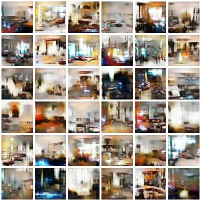

# pytorch-wgan-gp
PyTorch implementation of [Improved Training of Wasserstein GANs, arxiv:1704.00028](https://arxiv.org/abs/1704.00028)


## Results

Generated samples after training 1 epoch on LSUN Bedroom dataset




## Installation
```
$ git clone https://github.com/kuc2477/pytorch-wgan-gp && cd pytorch-wgan-gp
$ pip install -r requirements.txt
```

## CLI

#### Train
```
$ # To download LSUN dataset (optional)
$ ./lsun.py --category=bedroom          

$ # Run a visdom server and start training on LSUN dataset.
$ python -m visdom.server
$ ./main.py --dataset=lsun [--resume]
```

#### Test
```
$ ./main.py --test --dataset=lsun
$ # checkout "./samples" directory.
```


## References
- [Improved Training of Wasserstein GANs, arxiv:1704.00028](https://arxiv.org/abs/1704.00028)
- [caogang/wgan-gp](https://github.com/caogang/wgan-gp)


## Author
Ha Junsoo / [@kuc2477](https://github.com/kuc2477) / MIT License
