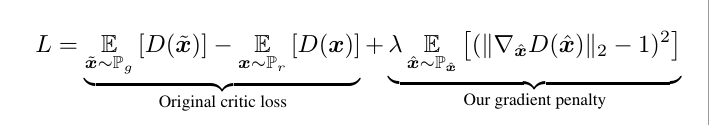

# pytorch-wgan-gp
PyTorch implementation of [Improved Training of Wasserstein GANs, arxiv:1704.00028](https://arxiv.org/abs/1704.00028)




## Results
WIP


## Installation
```
$ git clone https://github.com/kuc2477/pytorch-wgan-gp && cd pytorch-wgan-gp
$ pip install -r requirements.txt
```

## CLI
WIP


## References
- [Improved Training of Wasserstein GANs, arxiv:1704.00028](https://arxiv.org/abs/1704.00028)
- [caogang/wgan-gp](https://github.com/caogang/wgan-gp)


## Author
Ha Junsoo / [@kuc2477](https://github.com/kuc2477) / MIT License
